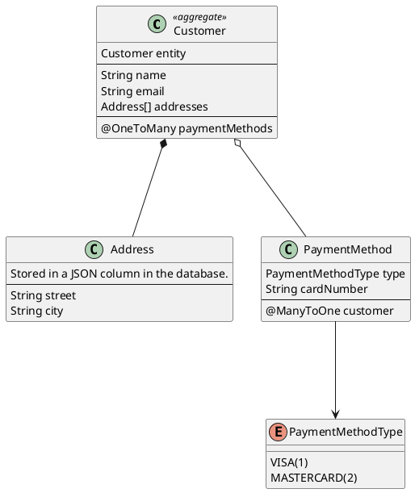

import { CodeGeneration, Image, Quote, QuoteAuthor, RemoteCode } from 'smooth-doc/components'

# Customer Address JPA Service
Canonical ZenWave example of a DDD Aggregate with JPA persistence and Externalized Domain Events.

This is a canonical example of a ZenWave designed and generated project, around a DDD Aggregate persisted with JPA and externalized Domain Events published to a Kafka topic. You can find the [Complete Source Code](https://github.com/ZenWave360/zenwave-playground/tree/main/examples/customer-address-jpa) at GitHub.

## Customer Aggregate and Service

This is a Java/SpringBoot microservice exposing CRUD operations for a `Customer` aggregate as a REST API and Kafka Domain Events.

The `Customer` entity is the root of the aggregate, holding relationships to other entities:
- an array of `Address` entities stored in a JSON column in the database and
- a `@OneToMany` collection of `PaymentMethod` entities.

NOTE: In this example, the `Customer` aggregate represents a cluster of related entities that are persisted and managed as a single unit. However, the business logic resides in the `CustomerService` class rather than within the entities themselves.

This pattern is sometimes called an "Anemic Domain Model." For this particular example, the domain complexity is relatively simple and doesn't justify implementing a Rich Domain Model with business logic embedded in the aggregate entities.



### REST API defined with OpenAPI

With these REST Endpoints:

https://github.com/ZenWave360/zenwave-playground/blob/main/examples/customer-address-jpa/src/main/resources/public/apis/openapi.yml


### Externalized Domain Events with AsyncAPI

And these Domain Events published to a Kafka Topic:

https://github.com/ZenWave360/zenwave-playground/blob/main/examples/customer-address-jpa/src/main/resources/public/apis/asyncapi.yml


## Building with ZenWave Domain Model and SDK

The full application was generated using this ZDL model:

<RemoteCode
  title="ZenWave Model for Customer Address JPA Service"
  language="zdl" collapsed={true}
  url="https://github.com/ZenWave360/zenwave-playground/blob/main/examples/customer-address-jpa/zenwave-model.zdl" />

and running each of these plugins using the [ZenWave Model Editor for IntelliJ](/plugin/):

<RemoteCode
  title="ZenWave Scripts for Customer Address JPA Service"
  language="zdl" collapsed={true}
  url="https://github.com/ZenWave360/zenwave-playground/blob/main/examples/customer-address-jpa/zenwave-scripts.zw" />

So let's dive into the details of how this application was built using ZenWave SDK.

### Model Configuration

Let's start with the configuration section of the ZDL model:

<RemoteCode
  title="ZenWave Model Configuration for Customer Address JPA Service"
  language="zdl" collapsed={false} visibleRange="1,18"
  url="https://github.com/ZenWave360/zenwave-playground/blob/main/examples/customer-address-jpa/zenwave-model.zdl" />

Basic settings:

- `title` and `basePackage` are self-explanatory and used throughout ZenWave SDK plugins for code and documentation generation.
- `persistence` tells the `BackendApplicationDefaultPlugin` which data store to target (`jpa` or `mongodb`), generating the appropriate Spring Data interfaces and controlling entity ID data types.
- `databaseType` works with `jpa` persistence to generate proper Hibernate configuration for ID generation strategies.
- `layout` determines the architectural structure generated by `BackendApplicationDefaultPlugin`. The `CleanHexagonalProjectLayout` creates a clean/hexagonal architecture with distinct layers: core domain, web adapters, and infrastructure. Note that JPA repository implementations are auto-generated by Spring Data, so no manual repository code is needed.

Additional configurations customizing the project layout:

- `openApiApiPackage`, `openApiModelPackage`, and `openApiModelNameSuffix` are used by the `OpenAPIControllersPlugin` and should match the values configured in the `openapi-generator-maven-plugin` in the `pom.xml` file.

<RemoteCode
  title="OpenAPI Generator Maven Plugin Configuration in pom.xml"
  language="xml" collapsed={true} visibleRange="326,362"
  url="https://github.com/ZenWave360/zenwave-playground/blob/main/examples/customer-address-jpa/pom.xml" />

### Domain Model

Domain modeling starts with the `entity` declarations. Entities body contains fields, nested entities. `id` and `version` fields are added automatically to entities. Entities decorated with `@auditing` will also have `createdDate`, `createdBy`, `lastModifiedDate`, and `lastModifiedBy` fields added automatically.

Entities decorated with `@aggregate` are considered the root of an aggregate and a Spring Data repository is generated for them and can be used on `services`.

Nested entities are equivalente not entities decorated with `@embedded` are not persisted separately, they are part of the aggregate root entity:

- In `mongodb` they are stored as nested documents and they don't have an id or version fields.
- In `jpa` they are stored either as `@Embeddable` or as a JSON column in the database. In this particular example, we are using a JSON column to store the `addresses` array in the `Customer` entity.

Relationships are modeled following JHipster JDL syntax and the corresponding fields are added to its entities. In DDD, rich relationships between aggregates and should be mapped only by their id. With ZenWave SDK you can use `@OneToXXX` relationships between aggregates, which are mapped by their id and have a read-only reference to the entity, allowing for a richer domain model in the ZDL while keeping the DDD principles. This is not the case in this example, but is good to know that possibility exists.

<RemoteCode
  title="ZenWave Domain Model for Customer Address JPA Service"
  language="zdl" collapsed={false} visibleRange="20,46"
  url="https://github.com/ZenWave360/zenwave-playground/blob/main/examples/customer-address-jpa/zenwave-model.zdl" />

<RemoteCode
  title="Customer Entity Generated by ZenWave SDK"
  language="java" collapsed={true}
  url="https://github.com/ZenWave360/zenwave-playground/blob/main/examples/customer-address-jpa/src/main/java/io/zenwave360/example/core/domain/Customer.java" />

<RemoteCode
  title="Address Nested Entity Generated by ZenWave SDK"
  language="java" collapsed={true}
  url="https://github.com/ZenWave360/zenwave-playground/blob/main/examples/customer-address-jpa/src/main/java/io/zenwave360/example/core/domain/Address.java" />

<RemoteCode
  title="PaymentMethod Nested Entity Generated by ZenWave SDK"
  language="java" collapsed={true}
  url="https://github.com/ZenWave360/zenwave-playground/blob/main/examples/customer-address-jpa/src/main/java/io/zenwave360/example/core/domain/PaymentMethod.java" />

Enums are also generated as Java enums, with an autogenerated JPA `AttributeConverter` which persists the enum the integer configured as `enumValue` in the ZDL model.

<RemoteCode
  title="PaymentMethodType Enum Generated by ZenWave SDK"
  language="java" collapsed={true}
  url="https://github.com/ZenWave360/zenwave-playground/blob/main/examples/customer-address-jpa/src/main/java/io/zenwave360/example/core/domain/PaymentMethodType.java" />

Aggregates will also get generated a Spring Data Repository interface and an InMemory implementation for testing purposes.

<RemoteCode
  title="CustomerRepository.java Generated by ZenWave SDK"
  language="java" collapsed={true}
  url="https://github.com/ZenWave360/zenwave-playground/blob/main/examples/customer-address-jpa/src/main/java/io/zenwave360/example/core/outbound/jpa/CustomerRepository.java" />

<RemoteCode
  title="InMemoryCustomerRepository.java Generated by ZenWave SDK"
  language="java" collapsed={true} visibleRange="1,33"
  url="https://github.com/ZenWave360/zenwave-playground/blob/main/examples/customer-address-jpa/src/test/java/io/zenwave360/example/infrastructure/jpa/inmemory/CustomerRepositoryInMemory.java" />


### Services

Services are the entry point to the core domain, and are generated as Spring `@Service` classes.

<RemoteCode
  title="Customer Service for (Customer)"
  language="zdl" collapsed={false} visibleRange="55,68"
  url="https://github.com/ZenWave360/zenwave-playground/blob/main/examples/customer-address-jpa/zenwave-model.zdl" />

This will generate a `CustomerService`, a `CustomerServiceImpl` referencing `CustomerRepository` (because it's this service`@aggregate` entity) and `CustomerServiceTest` that uses an in-memory implementation of the repository for testing.

<RemoteCode
  title="CustomerService.java Generated by ZenWave SDK"
  language="java" collapsed={true}
  url="https://github.com/ZenWave360/zenwave-playground/blob/main/examples/customer-address-jpa/src/main/java/io/zenwave360/example/core/inbound/CustomerService.java" />

<RemoteCode
  title="CustomerServiceImpl.java Generated by ZenWave SDK"
  language="java" collapsed={true}
  url="https://github.com/ZenWave360/zenwave-playground/blob/main/examples/customer-address-jpa/src/main/java/io/zenwave360/example/core/implementation/CustomerServiceImpl.java" />

<RemoteCode
  title="CustomerServiceTest.java Generated by ZenWave SDK"
  language="java" collapsed={true}
  url="https://github.com/ZenWave360/zenwave-playground/blob/main/examples/customer-address-jpa/src/test/java/io/zenwave360/example/core/CustomerServiceTest.java" />

This `CustomerServiceTest` is just an skeleton, you will need to provide testing data and assertions.


### Unit and Integration Tests

ZenWave SDK generates a complete suit of both Unit and Integration Tests:

#### Core Integration Tests

`BackendApplicationDefaultPlugin` generates Integration Tests for infrastructure classes, that is repositories that are set as `@SpringBootTests` against TestContainers with `docker-compose.yml`

It tests that JPA configuration and relationships are mapped correctly. You as the developer still need to populate test with input data and parameters and provide an initial state for your database in the standard file `src/test/resources/data.sql`. These integration tests are transactional so after each test database state is rolledback to its original state.

<RemoteCode
  title="Testing JPA and relationshipst in CustomerRepositoryIntegrationTest.java"
  language="java" collapsed={true} visibleRange="40,70"
  url="https://github.com/ZenWave360/zenwave-playground/blob/main/examples/customer-address-jpa/src/test/java/io/zenwave360/example/infrastructure/jpa/CustomerRepositoryIntegrationTest.java" />


#### Core Unit Tests

`BackendApplicationDefaultPlugin` also generates Unit Tests for your core services that will InMemory Repository implementations (avoiding using Mockito). It also generates a `ServicesInMemoryConfig.java` so you can get a service implementation wired with InMemory dependencies:

<RemoteCode
  title="Using ServicesInMemoryConfig.java in Service Tests"
  language="java" collapsed={true} visibleRange="19,33"
  url="https://github.com/ZenWave360/zenwave-playground/blob/main/examples/customer-address-jpa/src/test/java/io/zenwave360/example/core/implementation/CustomerServiceTest.java" />

You can provide in-memory test data creating as many json files in `src/test/resources/{{persistence}}/data/{{aggregateName}}/{{id}}.json` and they will populate the in-memory repository before each test.

<RemoteCode
  title="src/test/resources/data/jpa/customer/1.json"
  language="json" collapsed={true}
  url="https://github.com/ZenWave360/zenwave-playground/blob/main/examples/customer-address-jpa/src/test/resources/data/jpa/customer/1.json" />


### Exposing a REST API for your Service

Services can also be decorated with `@rest`, `get`, `@post`, `@put`, `@delete`, `@patch` annotations to document how they will be exposed to the outside world via REST API. `ZdlToOpenAPIPlugin` can generate a complete OpenAPI definition from these annotations, you can then further customize by hand or applying OpenAPI `overlays` at code generation time.

`ZdlToOpenAPIPlugin` will generate `#/components/schemas/**` for all entities, inputs and outputs present as part of your service commands. There are also annotations to create `@fileupload` and `@filedownload` endpoints, which are not part of this example. (See [Clinical Tool - Modulith](/docs/examples/ddd-examples/modulith-clinical-tool-jpa/) example for more details.)

#### Create Customer Endpoint

<CodeGeneration
  text1="When using the `ZDLToOpenAPIPlugin`, the following"
  sourceTitle="@post createCustomer(Customer) Customer" sourceLanguage="zdl" sourceVisibleRange="57,58" sourceCollapsed={false}
  sourceUrl="https://github.com/ZenWave360/zenwave-playground/blob/main/examples/customer-address-jpa/zenwave-model.zdl"
  text2="would produce this:"
  outputTitle="src/main/resources/public/apis/openapi.yml" outputLanguage="yaml" outputVisibleRange="27,44"
  outputUrl="https://github.com/ZenWave360/zenwave-playground/blob/main/examples/customer-address-jpa/src/main/resources/public/apis/openapi.yml"
/>

<CodeGeneration
  text1="When using the `OpenAPIControllersPlugin`, the following"
  sourceTitle="src/main/resources/public/apis/openapi.yml" sourceLanguage="yaml" sourceVisibleRange="27,44"
  sourceUrl="https://github.com/ZenWave360/zenwave-playground/blob/main/examples/customer-address-jpa/src/main/resources/public/apis/openapi.yml"
  text2="would produce this java code:"
  outputTitle="CustomerApiController.java" outputLanguage="java" outputVisibleRange="69,74"
  outputUrl="https://github.com/ZenWave360/zenwave-playground/blob/main/examples/customer-address-jpa/src/main/java/io/zenwave360/example/adapters/web/CustomerApiController.java"
/>

And its corresponding:

<RemoteCode
  title="CustomerDTOsMapper.java Generated by ZenWave SDK"
  language="java" collapsed={true} visibleRange="14,36"
  url="https://github.com/ZenWave360/zenwave-playground/blob/main/examples/customer-address-jpa/src/main/java/io/zenwave360/example/adapters/web/mappers/CustomerDTOsMapper.java" />

<RemoteCode
  title="CustomerApiControllerTest.java Generated by ZenWave SDK"
  language="java" collapsed={true} visibleRange="28,37"
  url="https://github.com/ZenWave360/zenwave-playground/blob/main/examples/customer-address-jpa/src/test/java/io/zenwave360/example/adapters/web/CustomerApiControllerTest.java" />

Remember that generated `Mappers` and `Tests` are provided as a starting point, you will need to adapt them to your needs.

#### Search Customer Endpoint

<CodeGeneration
  text1="When using the `ZDLToOpenAPIPlugin`, the following"
  sourceTitle="searchCustomers(CustomerSearchCriteria) Customer[]" sourceLanguage="zdl" sourceVisibleRange="65,67" sourceCollapsed={false}
  sourceUrl="https://github.com/ZenWave360/zenwave-playground/blob/main/examples/customer-address-jpa/zenwave-model.zdl"
  text2="would produce this:"
  outputTitle="src/main/resources/public/apis/openapi.yml" outputLanguage="yaml" outputVisibleRange="102,123"
  outputUrl="https://github.com/ZenWave360/zenwave-playground/blob/main/examples/customer-address-jpa/src/main/resources/public/apis/openapi.yml"
/>

<CodeGeneration
  text1="When using the `OpenAPIControllersPlugin`, the following"
  sourceTitle="src/main/resources/public/apis/openapi.yml" sourceLanguage="yaml" sourceVisibleRange="102,123"
  sourceUrl="https://github.com/ZenWave360/zenwave-playground/blob/main/examples/customer-address-jpa/src/main/resources/public/apis/openapi.yml"
  text2="would produce this java code:"
  outputTitle="CustomerApiController.java" outputLanguage="java" outputVisibleRange="105,119"
  outputUrl="https://github.com/ZenWave360/zenwave-playground/blob/main/examples/customer-address-jpa/src/main/java/io/zenwave360/example/adapters/web/CustomerApiController.java"
/>

And its corresponding:

<RemoteCode
  title="CustomerApiControllerTest.java Generated by ZenWave SDK"
  language="java" collapsed={true} visibleRange="65,73"
  url="https://github.com/ZenWave360/zenwave-playground/blob/main/examples/customer-address-jpa/src/test/java/io/zenwave360/example/adapters/web/CustomerApiControllerTest.java" />

#### Web Adapters Unit Tests

`OpenAPIControllersPlugin` will generate not only Spring MVC controllers implementing your openapi.yml but also Unit Tests that also uses `ServicesInMemoryConfig.java`.

<RemoteCode
  title="Unit Testing Spring MVC Controllers"
  language="java" collapsed={true} visibleRange="14,37"
  url="https://github.com/ZenWave360/zenwave-playground/blob/main/examples/customer-address-jpa/src/test/java/io/zenwave360/example/adapters/web/CustomerApiControllerTest.java" />

You can skip generating this controller Unit Tests if you prefer to test your REST API instead of the Java controllers.

### Web Adapters Integration Tests with Spring WebTestClient

If you prefer to test your REST API via HTTP semantics you can use `SpringWebTestClientPlugin` to generate both single endpoint tests as well as business flows spaning multiple endpoints:

<CodeGeneration
  text1="When using the `SpringWebTestClientPlugin`, the following"
  sourceTitle="zenwave-scripts.zw" sourceLanguage="zdl" sourceVisibleRange="31,33" sourceCollapsed={true}
  sourceUrl="https://github.com/ZenWave360/zenwave-playground/blob/main/examples/customer-address-jpa/zenwave-scripts.zw"
  text2="would produce this API test:"
  outputTitle="CustomerApiIntegrationTest" outputLanguage="java" outputCollapsed={true}
  outputUrl="https://github.com/ZenWave360/zenwave-playground/blob/main/examples/customer-address-jpa/src/main/java/io/zenwave360/example/adapters/web/CustomerApiController.java"
/>

<CodeGeneration
  text1="When using the `SpringWebTestClientPlugin`, the following"
  sourceTitle="zenwave-scripts.zw" sourceLanguage="zdl" sourceVisibleRange="35,44" sourceCollapsed={true}
  sourceUrl="https://github.com/ZenWave360/zenwave-playground/blob/main/examples/customer-address-jpa/zenwave-scripts.zw"
  text2="would produce this Business Flow API test:"
  outputTitle="CustomerApiIntegrationTest" outputLanguage="java" outputCollapsed={true}
  outputUrl="https://github.com/ZenWave360/zenwave-playground/blob/main/examples/customer-address-jpa/src/main/java/io/zenwave360/example/adapters/web/CreateUpdateDeleteCustomerIntegrationTest.java"
/>

You can control whether these are Unit or Integration Tests with `@SpringBootTest` in

<RemoteCode
  title="BaseWebTestClientTest.java"
  language="java" collapsed={true} visibleRange="14,27"
  url="https://github.com/ZenWave360/zenwave-playground/blob/main/examples/customer-address-jpa/src/test/java/io/zenwave360/example/adapters/web/BaseWebTestClientTest.java" />


As always is your task as the developer to populate input data and parameters in your java tests compatible with the initial state, whether its a conteinerized database or an inmemory implementation.


### Publishing Domain Events with AsyncAPI

You service commands can publish Domain Events as part of their operative using `withEvent` keyword:

<CodeGeneration
  text1="When using `withEvents` in service commands"
  sourceTitle="zenwave-model.zdl" sourceLanguage="zdl" sourceVisibleRange="62,62" sourceCollapsed={false}
  sourceUrl="https://github.com/ZenWave360/zenwave-playground/blob/main/examples/customer-address-jpa/zenwave-model.zdl"
  text2="would produce generate and use an EventsProvider in your service implementation:"
  outputTitle="CustomerServiceImpl.java" outputLanguage="java" outputVisibleRange="56,69" outputCollapsed={false}
  outputUrl="https://github.com/ZenWave360/zenwave-playground/blob/main/examples/customer-address-jpa/src/main/java/io/zenwave360/example/core/implementation/CustomerServiceImpl.java"
/>

You can control whether you want to keep you Domain Events internal to your application or publish them to an external broker and documented using AsyncAPI:

<RemoteCode
  title="Domain Events decorated with @asyncapi in ZDL"
  language="zdl" collapsed={false} visibleRange="70,82"
  url="https://github.com/ZenWave360/zenwave-playground/blob/main/examples/customer-address-jpa/zenwave-model.zdl" />

<CodeGeneration
  text1="Events decorated with `@asyncapi` when running `ZDLToAsyncAPIPlugin`"
  sourceTitle="zenwave-scripts.zw" sourceLanguage="zdl" sourceVisibleRange="12,19" sourceCollapsed={false}
  sourceUrl="https://github.com/ZenWave360/zenwave-playground/blob/main/examples/customer-address-jpa/zenwave-scripts.zw"
  text2="would generate a complete asyncapi.yml file (in this case, based in plugin configuration, including avro schemas `avro/*.avsc`)"
  outputTitle="src/main/resources/public/apis/asyncapi.yml" outputLanguage="yaml" outputCollapsed={true}
  outputUrl="https://github.com/ZenWave360/zenwave-playground/blob/main/examples/customer-address-jpa/src/main/resources/public/apis/asyncapi.yml"
/>

Then you can configure ZenWave SDK Maven Plugin to generate all required DTOs and the `EventProducer` we see before referenced in you `CustomerService.java`

<RemoteCode
  title="ZenWave SDK Maven Plugin configured to genreate Spring Cloud Stream code from asyncapi.yml"
  language="xml" collapsed={true} visibleRange="376,437"
  url="https://github.com/ZenWave360/zenwave-playground/blob/main/examples/customer-address-jpa/pom.xml" />

Please refer to https://www.zenwave360.io/zenwave-sdk/plugins/asyncapi-spring-cloud-streams3/ for more details about how to configure ZenWave SDK Maven Plugin.


## Running your freshly created Customer Service

### Requirements

* JDK 21+
* Maven 3.8.+
* Docker Compose: in case you don't have Docker-Compose installed in your machine, install [Rancher Desktop](https://rancherdesktop.io/) and configure `dockerd` as engine (instead of `containerd`), this will include `docker` and `docker-compose` commands in your PATH.
* Your favorite IDE

### Running Docker and Spring-Boot

Use the following commands to run the application or tests:

* Start docker dependencies:

```bash
docker-compose up -d
```

* Run the application:

```bash
mvn spring-boot:run
```

* Open [Swagger UI](http://localhost:8080/swagger-ui/index.html) in your browser.
Use "Basic Authentication" with username `admin` and password `password` to authenticate.

Happy Coding!! 🚀🚀🚀