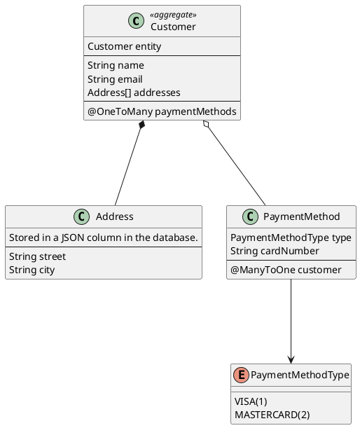

import { CodeGeneration, Image, Quote, QuoteAuthor, RemoteCode } from 'smooth-doc/components'

# Customer Address JPA Service
Canonical ZenWave example of a DDD Aggregate with JPA persistence and Externalized Domain Events.

This is a canonical example of a ZenWave designed and generated project, around a DDD Aggregate persisted with JPA and externalized Domain Events published to a Kafka topic. You can find the [Complete Source Code](https://github.com/ZenWave360/zenwave-playground/tree/main/examples/customer-address-jpa) at GitHub.

## What You'll Learn
- How to model a DDD aggregate using ZDL
- Generate REST APIs from domain models
- Implement event-driven architecture with AsyncAPI
- Create a complete Spring Boot microservice

We assume you have already read the [Getting Started](https://www.zenwave360.io/docs/getting-started/) section and installed ZenWave SDK CLI and IntelliJ Plugin and are somewhat familiar with the concepts of DDD and Event-Driven Architecture.

## What we will be building: A Customer Master Data Service

We will be building a Java/SpringBoot microservice exposing CRUD operations for a `Customer` aggregate as a REST API and publishing Domain Events to Kafka.

The `Customer` entity is the root of the aggregate, holding relationships to other entities:
- an array of `Address` entities stored in a JSON column in the database and
- a `@OneToMany` collection of `PaymentMethod` entities.

NOTE: In this example, the `Customer` aggregate represents a cluster of related entities that are persisted and managed as a single unit. However, the business logic resides in the `CustomerService` class rather than within the entities themselves.

This pattern is sometimes called an "Anemic Domain Model." For this particular example, the domain complexity is relatively simple and doesn't justify implementing a Rich Domain Model with business logic embedded in the aggregate entities.



### REST API defined with OpenAPI

With these REST Endpoints:

https://github.com/ZenWave360/zenwave-playground/blob/main/examples/customer-address-jpa/src/main/resources/public/apis/openapi.yml


### Externalized Domain Events with AsyncAPI

And these Domain Events published to a Kafka Topic:

https://github.com/ZenWave360/zenwave-playground/blob/main/examples/customer-address-jpa/src/main/resources/public/apis/asyncapi.yml


## Building with ZenWave Domain Model and SDK

When modeling a microservice with ZenWave SDK we usually do it using two main files:
- A `zenwave-model.zdl` file containing the domain model and service definitions, we use this file to iterate and refine the domain model.
- A `zenwave-scripts.zw` file containing the plugin configurations and executions, you can run each plugin individually from [ZenWave Model Editor for IntelliJ](/plugin/) to generate different aspects of the application.

The full application we are building in this example was defined in the following ZDL model:

<RemoteCode
  title="`zenwave-model.zdl` for Customer Master Data Service"
  language="zdl" collapsed={true}
  url="https://github.com/ZenWave360/zenwave-playground/blob/v20260120/examples/customer-address-jpa/zenwave-model.zdl" />

<RemoteCode
  title="`zenwave-scripts.zw` for Customer Master Data Service"
  language="zdl" collapsed={true}
  url="https://github.com/ZenWave360/zenwave-playground/blob/v20260120/examples/customer-address-jpa/zenwave-scripts.zw" />

> NOTE: You can name this files as you wish, just mind the file extension `.zdl` for the domain model and `.zw` for the scripts and in `.zw` pointing to the proper `zdlFile` file containing the domain model.

So let's dive into the details of how this application was built using ZenWave SDK.

### Model Configuration

Let's start with the configuration section of the ZDL model:

<RemoteCode
  title="ZenWave Model Configuration for Customer Master Data Service"
  language="zdl" collapsed={false} visibleRange="1,18"
  url="https://github.com/ZenWave360/zenwave-playground/blob/v20260120/examples/customer-address-jpa/zenwave-model.zdl" />

Basic settings:

- `title` and `basePackage` are self-explanatory and used throughout ZenWave SDK plugins for code and documentation generation.
- `persistence` tells the `BackendApplicationDefaultPlugin` which data store to target (`jpa` or `mongodb`), generating the appropriate Spring Data interfaces and controlling entity ID data types.
- `databaseType` works with `jpa` persistence to generate proper Hibernate configuration for ID generation strategies.
- `layout` determines the architectural structure generated by `BackendApplicationDefaultPlugin`. The `CleanHexagonalProjectLayout` creates a clean/hexagonal architecture with distinct layers: core domain, web adapters, and infrastructure. Note that JPA repository implementations are auto-generated by Spring Data, so no manual repository code is needed.

Additional configurations customizing the project layout:

- `openApiApiPackage`, `openApiModelPackage`, and `openApiModelNameSuffix` are used by the `OpenAPIControllersPlugin` and should match the values configured in the `openapi-generator-maven-plugin` in the `pom.xml` file.

<RemoteCode
  title="OpenAPI Generator Maven Plugin Configuration in pom.xml"
  language="xml" collapsed={true} visibleRange="383,419"
  url="https://github.com/ZenWave360/zenwave-playground/blob/v20260120/examples/customer-address-jpa/pom.xml" />

### Domain Modeling

Domain modeling starts with the `entity` declarations. Entities body contains fields, nested entities. `id` and `version` fields are added automatically to entities. Entities decorated with `@auditing` will also have `createdDate`, `createdBy`, `lastModifiedDate`, and `lastModifiedBy` fields added automatically.

Entities decorated with `@aggregate` are considered the root of an aggregate and a Spring Data repository is generated for them and can be used on `services`.

Nested entities are equivalente to entities decorated with `@embedded` which are not persisted separately, they are part of the aggregate root entity:

- In `mongodb` they are stored as nested documents, and they don't have an id or version fields.
- In `jpa` they are stored either as `@Embeddable` or as a JSON column in the database. In this particular example, we are using a JSON column to store the `addresses` array in the `Customer` entity. (Arrays are not supported as `@Embeddable` in JPA)

Relationships are modeled following JHipster JDL syntax and the corresponding fields are added to entities. In DDD, relationships between aggregates should typically be mapped only by their id. ZenWave SDK allows you to use `@OneToXXX` relationships between aggregates, which are mapped by their id and include a read-only reference to the related entity, enabling a richer domain model in the ZDL while maintaining DDD principles. This pattern is not used in this example, but it's good to know this capability exists.

<RemoteCode
  title="ZenWave Domain Model for Customer Master Data Service"
  language="zdl" collapsed={false} visibleRange="20,46"
  url="https://github.com/ZenWave360/zenwave-playground/blob/v20260120/examples/customer-address-jpa/zenwave-model.zdl" />

<RemoteCode
  title="Customer Entity Generated by ZenWave SDK"
  language="java" collapsed={true} visibleRange="22,113"
  url="https://github.com/ZenWave360/zenwave-playground/blob/v20260120/examples/customer-address-jpa/src/main/java/io/zenwave360/example/core/domain/Customer.java" />

<RemoteCode
  title="Address Nested Entity Generated by ZenWave SDK"
  language="java" collapsed={true}
  url="https://github.com/ZenWave360/zenwave-playground/blob/v20260120/examples/customer-address-jpa/src/main/java/io/zenwave360/example/core/domain/Address.java" />

<RemoteCode
  title="PaymentMethod Nested Entity Generated by ZenWave SDK"
  language="java" collapsed={true}
  url="https://github.com/ZenWave360/zenwave-playground/blob/v20260120/examples/customer-address-jpa/src/main/java/io/zenwave360/example/core/domain/PaymentMethod.java" />

Enums are also generated as Java enums, with an autogenerated JPA `AttributeConverter` which persists the enum the integer configured as `enumValue` in the ZDL model.

<RemoteCode
  title="PaymentMethodType Enum Generated by ZenWave SDK"
  language="java" collapsed={true}
  url="https://github.com/ZenWave360/zenwave-playground/blob/v20260120/examples/customer-address-jpa/src/main/java/io/zenwave360/example/core/domain/PaymentMethodType.java" />

Aggregates will also get generated a Spring Data Repository interface and an InMemory implementation for testing purposes.

<RemoteCode
  title="CustomerRepository.java Generated by ZenWave SDK"
  language="java" collapsed={true}
  url="https://github.com/ZenWave360/zenwave-playground/blob/v20260120/examples/customer-address-jpa/src/main/java/io/zenwave360/example/core/outbound/jpa/CustomerRepository.java" />

<RemoteCode
  title="InMemoryCustomerRepository.java Generated by ZenWave SDK"
  language="java" collapsed={true}
  url="https://github.com/ZenWave360/zenwave-playground/blob/v20260120/examples/customer-address-jpa/src/test/java/io/zenwave360/example/infrastructure/jpa/inmemory/CustomerRepositoryInMemory.java" />


### Services

Services are the entry point to the core domain, and are generated as Spring `@Service` classes.

<RemoteCode
  title="Customer Service for (Customer)"
  language="zdl" collapsed={false} visibleRange="55,68"
  url="https://github.com/ZenWave360/zenwave-playground/blob/v20260120/examples/customer-address-jpa/zenwave-model.zdl" />

This will generate a `CustomerService`, a `CustomerServiceImpl` referencing `CustomerRepository` (because it's this service`@aggregate` entity) and `CustomerServiceTest` that uses an in-memory implementation of the repository for testing.

<RemoteCode
  title="CustomerService.java Generated by ZenWave SDK"
  language="java" collapsed={true}
  url="https://github.com/ZenWave360/zenwave-playground/blob/v20260120/examples/customer-address-jpa/src/main/java/io/zenwave360/example/core/inbound/CustomerService.java" />

<RemoteCode
  title="CustomerServiceImpl.java Generated by ZenWave SDK"
  language="java" collapsed={true}
  url="https://github.com/ZenWave360/zenwave-playground/blob/v20260120/examples/customer-address-jpa/src/main/java/io/zenwave360/example/core/implementation/CustomerServiceImpl.java" />

<RemoteCode
  title="CustomerServiceTest.java Generated by ZenWave SDK"
  language="java" collapsed={true}
  url="https://github.com/ZenWave360/zenwave-playground/blob/v20260120/examples/customer-address-jpa/src/test/java/io/zenwave360/example/core/implementation/CustomerServiceTest.java" />

This `CustomerServiceTest` is just an skeleton, you will need to provide testing data and assertions.


### Unit and Integration Tests

ZenWave SDK generates a complete suit of both Unit and Integration Tests:

#### Core Integration Tests

`BackendApplicationDefaultPlugin` generates Integration Tests for `infrastructure` or `outbound adapter classes` (repositories in this case) that run as `@SpringBootTest` against TestContainers using [docker-compose.yml](https://github.com/ZenWave360/zenwave-playground/blob/main/examples/customer-address-jpa/docker-compose.yml) configuration.

These tests verify that JPA configuration and entity relationships are correctly mapped. As the developer, you need to populate tests with input data and assertions, and provide initial database state in the standard `src/test/resources/data.sql` file. These integration tests are transactional, so the database state is rolled back to its original state after each test.

<RemoteCode
  title="Testing JPA and relationshipst in CustomerRepositoryIntegrationTest.java"
  language="java" collapsed={true} visibleRange="39,64"
  url="https://github.com/ZenWave360/zenwave-playground/blob/v20260120/examples/customer-address-jpa/src/test/java/io/zenwave360/example/infrastructure/jpa/CustomerRepositoryIntegrationTest.java" />


Remember to verify that Services list in `DockerComposeInitializer.java` match the services declared in `docker-compose.yml`, pay particular attention to the database service name, which is `app` in this case.

<RemoteCode
  title="Services List in DockerComposeInitializer.java"
  language="java" collapsed={false} visibleRange="38,41"
  url="https://github.com/ZenWave360/zenwave-playground/blob/v20260120/examples/customer-address-jpa/src/test/java/io/zenwave360/example/config/DockerComposeInitializer.java" />

`DockerComposeInitializer.java` contains the annotation required to start TestContainers in your `@SpringBootTest` tests:

<RemoteCode
  title="BaseRepositoryIntegrationTest.java"
  language="java" collapsed={true}
  url="https://github.com/ZenWave360/zenwave-playground/blob/v20260120/examples/customer-address-jpa/src/test/java/io/zenwave360/example/infrastructure/jpa/BaseRepositoryIntegrationTest.java" />


#### Core Unit Tests

`BackendApplicationDefaultPlugin` also generates Unit Tests for your core services that use InMemory Repository implementations (avoiding Mockito). It also generates a `ServicesInMemoryConfig.java` to provide service implementations wired with InMemory dependencies:

<RemoteCode
  title="Using ServicesInMemoryConfig.java in Service Tests"
  language="java" collapsed={true} visibleRange="19,33"
  url="https://github.com/ZenWave360/zenwave-playground/blob/v20260120/examples/customer-address-jpa/src/test/java/io/zenwave360/example/core/implementation/CustomerServiceTest.java" />

You can provide in-memory test data by creating JSON files in `src/test/resources/{{persistence}}/data/{{aggregateName}}/{{id}}.json` - these will populate the in-memory repository before each test runs.

<RemoteCode
  title="src/test/resources/data/jpa/customer/1.json"
  language="json" collapsed={true}
  url="https://github.com/ZenWave360/zenwave-playground/blob/v20260120/examples/customer-address-jpa/src/test/resources/data/jpa/customer/1.json" />


### Exposing a REST API for your Service

Services can be decorated with `@rest`, `@get`, `@post`, `@put`, `@delete`, `@patch` annotations to document how they will be exposed as REST endpoints. The `ZdlToOpenAPIPlugin` can generate a complete OpenAPI definition from these annotations, which you can then customize manually or by applying OpenAPI overlays during code generation.

The `ZdlToOpenAPIPlugin` will generate `#/components/schemas/**` for all entities, inputs and outputs used in your service commands. Additional annotations like `@fileupload` and `@filedownload` are available for file handling endpoints (see the [Clinical Tool - Modulith](/docs/examples/ddd-examples/modulith-clinical-tool-jpa/) example for details).

#### Create Customer Endpoint

<CodeGeneration
  text1="When using the `ZDLToOpenAPIPlugin`, the following"
  sourceTitle="this service command:" sourceLanguage="zdl" sourceVisibleRange="57,58" sourceCollapsed={false}
  sourceUrl="https://github.com/ZenWave360/zenwave-playground/blob/v20260120/examples/customer-address-jpa/zenwave-model.zdl"
  text2="would produce this:"
  outputTitle="src/main/resources/public/apis/openapi.yml" outputLanguage="yaml" outputVisibleRange="27,44"
  outputUrl="https://github.com/ZenWave360/zenwave-playground/blob/v20260120/examples/customer-address-jpa/src/main/resources/public/apis/openapi.yml"
/>

<CodeGeneration
  text1="When using the `OpenAPIControllersPlugin`, the following"
  sourceTitle="src/main/resources/public/apis/openapi.yml" sourceLanguage="yaml" sourceVisibleRange="27,44"
  sourceUrl="https://github.com/ZenWave360/zenwave-playground/blob/v20260120/examples/customer-address-jpa/src/main/resources/public/apis/openapi.yml"
  text2="would produce this java code:"
  outputTitle="CustomerApiController.java" outputLanguage="java" outputVisibleRange="52,59"
  outputUrl="https://github.com/ZenWave360/zenwave-playground/blob/v20260120/examples/customer-address-jpa/src/main/java/io/zenwave360/example/adapters/web/CustomerApiController.java"
/>

And its corresponding:

<RemoteCode
  title="CustomerDTOsMapper.java Generated by ZenWave SDK"
  language="java" collapsed={true} visibleRange="13,34"
  url="https://github.com/ZenWave360/zenwave-playground/blob/v20260120/examples/customer-address-jpa/src/main/java/io/zenwave360/example/adapters/web/mappers/CustomerDTOsMapper.java" />

<RemoteCode
  title="CustomerApiControllerTest.java Generated by ZenWave SDK"
  language="java" collapsed={true} visibleRange="26,35"
  url="https://github.com/ZenWave360/zenwave-playground/blob/v20260120/examples/customer-address-jpa/src/test/java/io/zenwave360/example/adapters/web/CustomerApiControllerTest.java" />

> Remember that generated `Mappers` and `Tests` are provided as a starting point, you will need to adapt them to your needs.

#### Search Customer Endpoint

<CodeGeneration
  text1="When using the `ZDLToOpenAPIPlugin`, the following"
  sourceTitle="sevice command `@paginated` and returning an aray:" sourceLanguage="zdl" sourceVisibleRange="65,67" sourceCollapsed={false}
  sourceUrl="https://github.com/ZenWave360/zenwave-playground/blob/v20260120/examples/customer-address-jpa/zenwave-model.zdl"
  text2="would produce this:"
  outputTitle="src/main/resources/public/apis/openapi.yml" outputLanguage="yaml" outputVisibleRange="102,123"
  outputUrl="https://github.com/ZenWave360/zenwave-playground/blob/v20260120/examples/customer-address-jpa/src/main/resources/public/apis/openapi.yml"
/>

<CodeGeneration
  text1="When using the `OpenAPIControllersPlugin`, the previous OpenAPI definition:"
  sourceTitle="src/main/resources/public/apis/openapi.yml" sourceLanguage="yaml" sourceVisibleRange="102,123"
  sourceUrl="https://github.com/ZenWave360/zenwave-playground/blob/v20260120/examples/customer-address-jpa/src/main/resources/public/apis/openapi.yml"
  text2="would produce this java code:"
  outputTitle="CustomerApiController.java" outputLanguage="java" outputVisibleRange="94,116"
  outputUrl="https://github.com/ZenWave360/zenwave-playground/blob/v20260120/examples/customer-address-jpa/src/main/java/io/zenwave360/example/adapters/web/CustomerApiController.java"
/>

And its corresponding:

<RemoteCode
  title="CustomerApiControllerTest.java Generated by ZenWave SDK"
  language="java" collapsed={true} visibleRange="63,71"
  url="https://github.com/ZenWave360/zenwave-playground/blob/v20260120/examples/customer-address-jpa/src/test/java/io/zenwave360/example/adapters/web/CustomerApiControllerTest.java" />

#### Web Adapters Unit Tests

`OpenAPIControllersPlugin` generates Spring MVC controllers that implement your OpenAPI specification, along with corresponding Unit Tests that use `ServicesInMemoryConfig.java` for dependency injection.

<RemoteCode
  title="Unit Testing Spring MVC Controllers"
  language="java" collapsed={true} visibleRange="12,36"
  url="https://github.com/ZenWave360/zenwave-playground/blob/v20260120/examples/customer-address-jpa/src/test/java/io/zenwave360/example/adapters/web/CustomerApiControllerTest.java" />

You can disable controller Unit Test generation if you prefer to test your REST API through HTTP calls instead of testing the Java controllers directly.

### Web Adapters Integration Tests with Spring WebTestClient

If you prefer to test your REST API via HTTP semantics you can use `SpringWebTestClientPlugin` to generate both single endpoint tests as well as business flows spaning multiple endpoints:

<CodeGeneration
  text1="When using the `SpringWebTestClientPlugin`, the following"
  sourceTitle="zenwave-scripts.zw" sourceLanguage="zdl" sourceVisibleRange="31,33" sourceCollapsed={true}
  sourceUrl="https://github.com/ZenWave360/zenwave-playground/blob/v20260120/examples/customer-address-jpa/zenwave-scripts.zw"
  text2="would produce this API test:"
  outputTitle="CustomerApiIntegrationTest" outputLanguage="java" outputCollapsed={true}
  outputUrl="https://github.com/ZenWave360/zenwave-playground/blob/v20260120/examples/customer-address-jpa/src/test/java/io/zenwave360/example/adapters/web/CustomerApiControllerTest.java"
/>

<CodeGeneration
  text1="When using the `SpringWebTestClientPlugin`, the following"
  sourceTitle="zenwave-scripts.zw" sourceLanguage="zdl" sourceVisibleRange="35,40" sourceCollapsed={true}
  sourceUrl="https://github.com/ZenWave360/zenwave-playground/blob/v20260120/examples/customer-address-jpa/zenwave-scripts.zw"
  text2="would produce this Business Flow API test:"
  outputTitle="CustomerApiIntegrationTest" outputLanguage="java" outputCollapsed={true}
  outputUrl="https://github.com/ZenWave360/zenwave-playground/blob/v20260120/examples/customer-address-jpa/src/test/java/io/zenwave360/example/adapters/web/CreateUpdateDeleteCustomerIntegrationTest.java"
/>

You can control whether these are Unit or Integration Tests with `@SpringBootTest` in

<RemoteCode
  title="BaseWebTestClientTest.java"
  language="java" collapsed={true} visibleRange="13,29"
  url="https://github.com/ZenWave360/zenwave-playground/blob/v20260120/examples/customer-address-jpa/src/test/java/io/zenwave360/example/adapters/web/BaseWebTestClientTest.java" />


As always, it's your responsibility as the developer to provide test data and parameters that match the initial state, whether you're using a containerized database or an in-memory implementation.


### Publishing Domain Events with AsyncAPI

You service commands can publish Domain Events as part of their operative using `withEvent` keyword:

<CodeGeneration
  text1="When using `withEvents` in service commands"
  sourceTitle="zenwave-model.zdl" sourceLanguage="zdl" sourceVisibleRange="61,62" sourceCollapsed={false}
  sourceUrl="https://github.com/ZenWave360/zenwave-playground/blob/v20260120/examples/customer-address-jpa/zenwave-model.zdl"
  text2="would produce generate and use an EventsProvider in your service implementation:"
  outputTitle="CustomerServiceImpl.java" outputLanguage="java" outputVisibleRange="55,71" outputCollapsed={false}
  outputUrl="https://github.com/ZenWave360/zenwave-playground/blob/v20260120/examples/customer-address-jpa/src/main/java/io/zenwave360/example/core/implementation/CustomerServiceImpl.java"
/>

You can control whether you want to keep you Domain Events internal to your application or publish them to an external broker and documented using AsyncAPI:

<RemoteCode
  title="Domain Events decorated with @asyncapi in ZDL"
  language="zdl" collapsed={false} visibleRange="70,82"
  url="https://github.com/ZenWave360/zenwave-playground/blob/v20260120/examples/customer-address-jpa/zenwave-model.zdl" />

<CodeGeneration
  text1="Events decorated with `@asyncapi` when running `ZDLToAsyncAPIPlugin`"
  sourceTitle="zenwave-scripts.zw" sourceLanguage="zdl" sourceVisibleRange="12,19" sourceCollapsed={false}
  sourceUrl="https://github.com/ZenWave360/zenwave-playground/blob/v20260120/examples/customer-address-jpa/zenwave-scripts.zw"
  text2="would generate a complete asyncapi.yml file (in this case, based in plugin configuration, including avro schemas `avro/*.avsc`)"
  outputTitle="src/main/resources/public/apis/asyncapi.yml" outputLanguage="yaml" outputCollapsed={true}
  outputUrl="https://github.com/ZenWave360/zenwave-playground/blob/v20260120/examples/customer-address-jpa/src/main/resources/public/apis/asyncapi.yml"
/>

Then you can configure ZenWave SDK Maven Plugin to generate all required DTOs and the `EventProducer` we see before referenced in you `CustomerService.java`

<RemoteCode
  title="ZenWave SDK Maven Plugin (AsyncAPIGenerator) configured to genreate SpringCloudStream and Avro code from asyncapi.yml"
  language="xml" collapsed={true} visibleRange="420,476"
  url="https://github.com/ZenWave360/zenwave-playground/blob/v20260120/examples/customer-address-jpa/pom.xml" />


Please refer to https://www.zenwave360.io/zenwave-sdk/plugins/asyncapi-generator/ for more details about how to configure ZenWave SDK Maven Plugin.


## Running the Customer Service

### Prerequisites

* **JDK 21+**
* **Maven 3.8+**
* **Docker & Docker Compose** - If you don't have Docker Compose installed, we recommend [Rancher Desktop](https://rancherdesktop.io/) configured with `dockerd` engine (not `containerd`), which includes both `docker` and `docker-compose` commands.
* **Your favorite IDE**

### Quick Start

Follow these steps to run the complete application:

1. **Start infrastructure services:**
   ```bash
   docker-compose up -d
   ```

2. **Run the Spring Boot application:**
   ```bash
   mvn spring-boot:run
   ```

3. **Access the API:**
   - Open [Swagger UI](http://localhost:8080/swagger-ui/index.html) in your browser
   - Use **Basic Authentication**: username `admin`, password `password`

4. **Test the endpoints:**
   - Try creating a customer via the POST `/customers` endpoint
   - Retrieve customers using GET `/customers/search`

### What's Running

- **PostgreSQL** (port 5432) - Customer data persistence
- **Kafka** (port 9092) - Domain events messaging
- **Spring Boot App** (port 8080) - REST API and business logic

Happy Coding! 🚀
