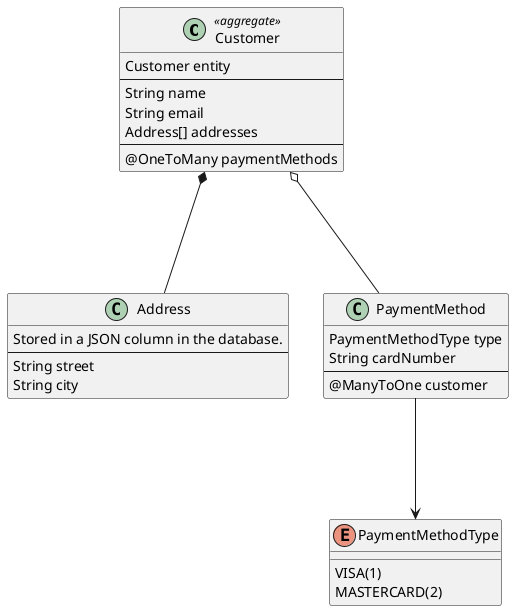

import { Image, Quote, QuoteAuthor, RemoteCode } from "smooth-doc/components";

# Customer Address JPA Service

https://github.com/ZenWave360/zenwave-playground/tree/main/examples/kustomer-address-jpa

SpringBoot + Java microservice for a "Customer Address Service" using JPA for persistence for this Domain Model:

With these REST Endpoints:

And these Domain Events published to a Kafka Topic:

As defined on this

<RemoteCode
  title="ZenWave Model for Customer Address JPA Service"
  language="zdl"
  url="https://github.com/ZenWave360/zenwave-playground/blob/main/examples/kustomer-address-jpa/zenwave-model.zdl" />

And generated using this

<RemoteCode
  title="ZenWave Scripts for Customer Address JPA Service"
  language="zdl"
  url="https://github.com/ZenWave360/zenwave-playground/blob/main/examples/kustomer-address-jpa/zenwave-scripts.zw" />

with [ZenWave Model Editor] for IntelliJ IDEA.
