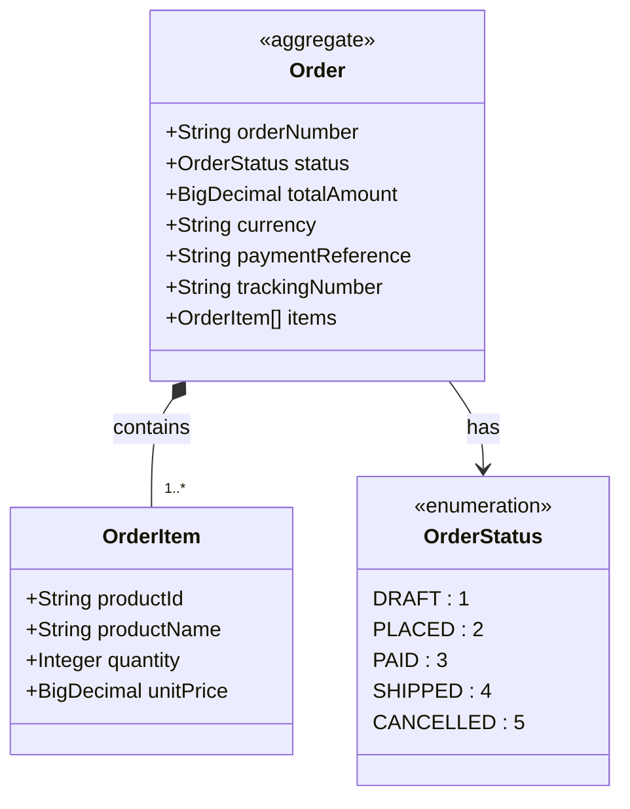

import { CodeGeneration, Image, Quote, QuoteAuthor, RemoteCode } from 'smooth-doc/components'
import orderFulfillmentKotlin from './images/order-fulfillment-kotlin.excalidraw.svg';

# Order Fulfillment (Kotlin)

Complete order fulfillment microservice built with Kotlin, demonstrating DDD patterns and event-driven architecture with ZenWave SDK.

<Image title="Order Fulfillment (Kotlin)" src={orderFulfillmentKotlin}  />

This is a complete example of a ZenWave designed and generated project built with Kotlin, implementing an Order Fulfillment domain with JPA persistence and Domain Events published to Kafka. You can find the [Complete Source Code](https://github.com/ZenWave360/zenwave-playground/tree/main/examples/order-fulfillment-kotlin) at GitHub.

## What You'll Learn
- Model a DDD aggregate with state transitions using ZDL
- Generate Kotlin code from domain models
- Implement REST APIs with OpenAPI and Kotlin
- Publish domain events with AsyncAPI and Kafka
- Build a complete Spring Boot microservice in Kotlin

We assume you have already read the [Getting Started](https://www.zenwave360.io/docs/getting-started/) section and installed ZenWave SDK CLI and IntelliJ Plugin and are somewhat familiar with the concepts of DDD and Event-Driven Architecture.

## What we will be building: An Order Fulfillment Service

We will be building a Kotlin/Spring Boot microservice that manages the complete order fulfillment lifecycle, from order placement through payment and shipping, exposing REST APIs and publishing Domain Events to Kafka.

The `Order` entity is the root of the aggregate, managing the order lifecycle through distinct states:
- **DRAFT** → **PLACED** → **PAID** → **SHIPPED** → **CANCELLED**

The Order aggregate contains:
- Order metadata (orderNumber, status, totalAmount, currency)
- Payment information (paymentReference)
- Shipping information (trackingNumber)
- An array of `OrderItem` entities stored in a JSON column

**Business Rules:**
- Order numbers must be unique
- Shipped orders cannot be cancelled

### Domain Model Diagram



### REST API defined with OpenAPI

The application exposes REST endpoints for managing the order lifecycle:

- `POST /api/orders` - Place a new order
- `POST /api/orders/{orderNumber}/pay` - Pay for an order
- `POST /api/orders/{orderNumber}/ship` - Ship an order
- `POST /api/orders/{orderNumber}/cancel` - Cancel an order
- `GET /api/orders/{orderNumber}` - Get order details

<RemoteCode
  title="OpenAPI Definition for Order Fulfillment Service"
  language="yaml" collapsed={true}
  url="https://github.com/ZenWave360/zenwave-playground/blob/v20260120/examples/order-fulfillment-kotlin/src/main/resources/public/apis/openapi.yml" />

### Domain Events with AsyncAPI

The application publishes domain events to Kafka topics for each state transition:

- `orders.placed` - OrderPlaced events
- `orders.paid` - OrderPaid events
- `orders.shipped` - OrderShipped events
- `orders.cancelled` - OrderCancelled events

Events include CloudEvents headers and Kafka message keys for proper routing and traceability.

<RemoteCode
  title="AsyncAPI Definition for Order Events"
  language="yaml" collapsed={true}
  url="https://github.com/ZenWave360/zenwave-playground/blob/v20260120/examples/order-fulfillment-kotlin/src/main/resources/public/apis/asyncapi.yml" />

## Building with ZenWave Domain Model and SDK

When modeling a microservice with ZenWave SDK we usually do it using two main files:
- A `zenwave-model.zdl` file containing the domain model and service definitions, we use this file to iterate and refine the domain model.
- A `zenwave-scripts.zw` file containing the plugin configurations and executions, you can run each plugin individually from [ZenWave Model Editor for IntelliJ](/plugin/) to generate different aspects of the application.

The full application we are building in this example was defined in the following ZDL model:

<RemoteCode
  title="`zenwave-model.zdl` for Order Fulfillment Service"
  language="zdl" collapsed={true}
  url="https://github.com/ZenWave360/zenwave-playground/blob/v20260120/examples/order-fulfillment-kotlin/zenwave-model.zdl" />

<RemoteCode
  title="`zenwave-scripts.zw` for Order Fulfillment Service"
  language="zdl" collapsed={true}
  url="https://github.com/ZenWave360/zenwave-playground/blob/v20260120/examples/order-fulfillment-kotlin/zenwave-scripts.zw" />

> NOTE: You can name these files as you wish, just mind the file extension `.zdl` for the domain model and `.zw` for the scripts and in `.zw` pointing to the proper `zdlFile` file containing the domain model.

So let's dive into the details of how this application was built using ZenWave SDK.

### Domain Modeling

The Order aggregate is modeled with a natural ID (`orderNumber`) and includes order items stored as a JSON array. The domain model defines the complete order lifecycle with state transitions and business rules.

<RemoteCode
  title="Order Entity in ZDL"
  language="zdl" collapsed={false} visibleRange="17,46"
  url="https://github.com/ZenWave360/zenwave-playground/blob/v20260120/examples/order-fulfillment-kotlin/zenwave-model.zdl" />

This generates the following Kotlin entity:

<RemoteCode
  title="Order.kt - Generated Kotlin Entity"
  language="kotlin" collapsed={true}
  url="https://github.com/ZenWave360/zenwave-playground/blob/v20260120/examples/order-fulfillment-kotlin/src/main/kotlin/io/zenwave360/example/orderfulfillment/domain/Order.kt" />

<RemoteCode
  title="OrderStatus.kt - Generated Kotlin Enum"
  language="kotlin" collapsed={true}
  url="https://github.com/ZenWave360/zenwave-playground/blob/v20260120/examples/order-fulfillment-kotlin/src/main/kotlin/io/zenwave360/example/orderfulfillment/domain/OrderStatus.kt" />

<RemoteCode
  title="OrderItem.kt - Generated Kotlin Value Object"
  language="kotlin" collapsed={true}
  url="https://github.com/ZenWave360/zenwave-playground/blob/v20260120/examples/order-fulfillment-kotlin/src/main/kotlin/io/zenwave360/example/orderfulfillment/domain/OrderItem.kt" />

Aggregates will also get generated a Spring Data Repository interface and an InMemory implementation for testing purposes.

<RemoteCode
  title="OrderRepository.kt - Generated Repository Interface"
  language="kotlin" collapsed={true}
  url="https://github.com/ZenWave360/zenwave-playground/blob/v20260120/examples/order-fulfillment-kotlin/src/main/kotlin/io/zenwave360/example/orderfulfillment/OrderRepository.kt" />

### Services

Services are the entry point to the core domain, and are generated as Spring `@Service` classes. The Order service defines commands for each state transition in the order lifecycle.

<RemoteCode
  title="OrderService.kt - Generated Service Interface"
  language="kotlin" collapsed={false}
  url="https://github.com/ZenWave360/zenwave-playground/blob/v20260120/examples/order-fulfillment-kotlin/src/main/kotlin/io/zenwave360/example/orderfulfillment/OrderService.kt" />

<RemoteCode
  title="OrderServiceImpl.kt - Generated Service Implementation"
  language="kotlin" collapsed={true}
  url="https://github.com/ZenWave360/zenwave-playground/blob/v20260120/examples/order-fulfillment-kotlin/src/main/kotlin/io/zenwave360/example/orderfulfillment/OrderServiceImpl.kt" />

### Exposing REST APIs

The REST API is generated from the OpenAPI specification, creating Spring MVC controllers that delegate to the service layer.

<RemoteCode
  title="OrderApiController.kt - Generated REST Controller"
  language="kotlin" collapsed={true}
  url="https://github.com/ZenWave360/zenwave-playground/blob/v20260120/examples/order-fulfillment-kotlin/src/main/kotlin/io/zenwave360/example/orderfulfillment/OrderApiController.kt" />

<RemoteCode
  title="OrderDTOsMapper.kt - Generated DTO Mapper"
  language="kotlin" collapsed={true}
  url="https://github.com/ZenWave360/zenwave-playground/blob/v20260120/examples/order-fulfillment-kotlin/src/main/kotlin/io/zenwave360/example/orderfulfillment/mappers/OrderDTOsMapper.kt" />

### Publishing Domain Events

Service commands publish Domain Events as part of their operations. Events are defined in the ZDL model and generated code handles the publishing to Kafka.

<RemoteCode
  title="OrderServiceImpl.kt - Using Generated Events Producer"
  language="kotlin" collapsed={true} visibleRange="17,45"
  url="https://github.com/ZenWave360/zenwave-playground/blob/v20260120/examples/order-fulfillment-kotlin/src/main/kotlin/io/zenwave360/example/orderfulfillment/OrderServiceImpl.kt" />

`OrderEventsProducer` is generated from the AsyncAPI definition using ZenWave SDK Maven Plugin.

## Running the Order Fulfillment Service

### Prerequisites

* **JDK 24**
* **Maven 3.8+**
* **Docker & Docker Compose** - If you don't have Docker Compose installed, we recommend [Rancher Desktop](https://rancherdesktop.io/) configured with `dockerd` engine (not `containerd`), which includes both `docker` and `docker-compose` commands.
* **Your favorite IDE**

### Quick Start

Follow these steps to run the complete application:

1. **Start infrastructure services:**
   ```bash
   docker-compose up -d
   ```

2. **Run the Spring Boot application:**
   ```bash
   mvn spring-boot:run
   ```

3. **Access the API:**
   - Open [Swagger UI](http://localhost:8080/swagger-ui/index.html) in your browser
   - Use **Basic Authentication**: username `admin`, password `password`

4. **Test the order lifecycle:**
   - Create a new order via POST `/api/orders`
   - Pay for the order via POST `/api/orders/{orderNumber}/pay`
   - Ship the order via POST `/api/orders/{orderNumber}/ship`
   - Retrieve order details via GET `/api/orders/{orderNumber}`

### What's Running

- **PostgreSQL** (port 5432) - Order data persistence
- **Kafka** (port 9092) - Domain events messaging
- **Spring Boot App** (port 8080) - REST API and business logic

Happy Coding! 🚀
