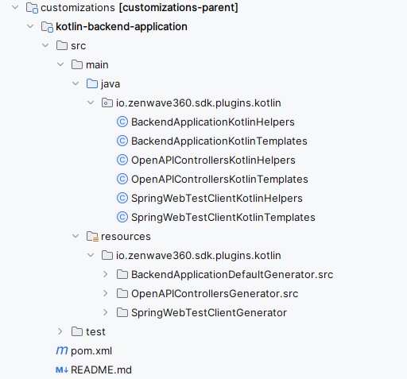

import { Image, Quote, QuoteAuthor, Orange } from "smooth-doc/components";
import backendIntelliJPluginsImage from './images/SDK-Backend-IntelliJ-Plugins.png'
import sdkHexagonalDark from './images/SDK-ServiceImplementation-Hexagonal.dark.png'
import sdkHexagonalLight from './images/SDK-ServiceImplementation-Hexagonal.light.png'

# Customizing Generated Code
ZenWaveSDK adapts to your team's coding style, preferences and custom libraries.

Like many great open source projects, ZenWaveSDK was created to solve real problems. It's designed to be easily customizable for any team or organization - whether you need specific coding styles, custom libraries, annotations, or internal frameworks.

By default, ZenWaveSDK generates a complete SpringBoot backend application following industry best practices, with a minimal dependency set: Spring-Data JPA and MongoDB, SpringMVC, SpringCloudStreams, MapStruct and optional Lombok integration.

You can customize the generated code in several ways:

- <Orange>Configuring different Project Layouts</Orange>: CleanHexagonal, Layered, SimpleDomain, HexagonalArchitecture, CleanArchitecture...
- <Orange>Customizing Standard Templates:</Orange> providing your own versions of any standard template
- <Orange>Full Source Code Customization:</Orange> see SpringBoot with Kotlin Customization as an example.

NOTE: The less customization you need, the less effort you'll spend creating and maintaining it.

## Configuring different Project Layouts

By default, ZenWave SDK generates a Spring Boot/Spring Cloud backend application using a flexible hexagonal/clean architecture approach. However, the toolkit offers several alternative layouts to match your preferred architectural style:

```zdl
config {
    title "My Backend Application"
    basePackage "com.example.my.backend"
    // Available layout options:
    //      - DefaultProjectLayout
    //      - CleanHexagonalProjectLayout
    //      - LayeredProjectLayout
    //      - SimpleDomainProjectLayout
    //      - HexagonalProjectLayout
    //      - CleanArchitectureProjectLayout
    layout CleanHexagonalProjectLayout
}
```

You can customize any package path in your chosen layout through properties in the config section or as parameters in the CLI plugin:

```zdl
config {
    //...
    layout CleanHexagonalProjectLayout

    layout.entitiesPackage "{{basePackage}}.core.model"
    layout.openApiApiPackage "{{basePackage}}.web"
    layout.openApiModelPackage "{{basePackage}}.web.dtos"
}
```

For complete customization, you can create your own implementation of the [ProjectLayout](https://github.com/ZenWave360/zenwave-sdk/blob/main/zenwave-sdk-cli/src/main/java/io/zenwave360/sdk/zdl/layouts/ProjectLayout.java#L13) class.

> Tip: You can organize your application into multiple modules, each using a different layout.

### CleanHexagonalProjectLayout

This is the default project layout, which the source code templates are designed around. It implements a pragmatic hexagonal/clean architecture with:
- A central `core` package containing domain entities and aggregates
  - `inbound` (primary ports) and `outbound` (secondary ports) interfaces
  - and the internal `implementation` of `inbound` interfaces, which uses the `outbound` interfaces to interact with external services.

```
📦 {{basePackage}}
   📦 adapters
       └─ web
       |  └─ RestControllers (spring mvc)
       └─ events
          └─ *EventListeners (spring-cloud-streams)
   📦 core
       ├─ 📦 domain
       |     └─ (entities and aggregates)
       ├─ 📦 inbound
       |     ├─ dtos/
       |     └─ ServiceInterface (inbound service interface)
       ├─ 📦 outbound
       |     ├─ mongodb
       |     |  └─ *RepositoryInterface (spring-data interface)
       |     └─ jpa
       |        └─ *RepositoryInterface (spring-data interface)
       └─ 📦 implementation
             ├─ mappers/
             └─ ServiceImplementation (inbound service implementation)
   📦 infrastructure
     ├─ mongodb
     |  └─ CustomRepositoryImpl (spring-data custom implementation)
     └─ jpa
        └─ CustomRepositoryImpl (spring-data custom implementation)
```

<Image alt="ZenWave SDK Modeling Languages" src={sdkHexagonalDark} />

#### Notes about Generated Clean/Hexagonal Architecture

To balance pragmatism with architectural purity, this implementation makes two practical compromises:

1. Domain entities directly use JPA or SpringData MongoDB annotations
2. Spring Data Repository interfaces serve as outbound adapters/secondary ports, while their implementations remain outside the core domain

These design choices significantly reduce the complexity of your codebase by minimizing the number of mappers and DTOs needed, while still maintaining the key benefits of hexagonal/clean architecture - clear separation between core domain and external systems.

For testing, ZenWave SDK provides in-memory implementations of Spring Data Repository interfaces, eliminating the need for a database or mocking frameworks. This demonstrates that your core business logic remains decoupled from specific persistence technologies.

If you believe your project genuinely requires the ability to swap persistence implementations (a rare need in most applications), and you're willing to accept the additional complexity of extra mapping layers, you can create custom templates as described in the [Full Source Code Customization](#full-source-code-customization) section.

### LayeredProjectLayout

This is the classical layered architecture with `domain`, `repository`, `events`, `commands`, `service` and `web` layers.

```
📦 {{basePackage}}                            # Root package
   📦 config                                  # Spring Boot configuration, security, etc.
   📦 domain                                  # Domain Layer (Business Entities and Events)
       ├─ *Entities
       └─ events/
          └─ *DomainEvents
   📦 repository                              # Repository Layer (Persistence and Data Access)
       ├─ {{persistence}}/
       |   ├─ *RepositoryInterface            # Persistence interface (Spring Data, etc.)
       |   └─ *RepositoryImpl                 # Repository implementation
   📦 events                                  # Events Layer (Internal and Async API Events)
       ├─ *EventListeners                     # Event listeners
   📦 commands                                # Command Layer (Command Handlers)
       ├─ *CommandHandlers                    # Command handlers (e.g., CQRS commands)
   📦 service                                 # Service Layer (Business Logic and DTOs)
       ├─ dtos/
       |   └─ *DTOs                           # Data Transfer Objects
       ├─ impl/
       |   └─ *ServiceImplementation          # Service implementations
       └─ impl/mappers/
           └─ *Mappers                        # Object mappers for transformations
   📦 web                                     # Web Layer (Controllers and API)
       ├─ *RestControllers                    # REST controllers (Spring MVC, etc.)
       └─ mappers/
          └─ *WebMappers                      # Mappers for web layer transformations
```

### SimpleDomainProjectLayout

This is a very simple and flat structure, with no particular layering. It's useful for small services or modules with just one entity or aggregate.

```
📦 {{basePackage}}
   └─ 📦 config
   └─ 📦 model (entities and aggregates)
   └─ 📦 dtos
   └─ 📦 events
   ├─ 📦 mappers
   ├─ EventListeners (spring-cloud-streams)
   ├─ RestControllers (spring mvc)
   ├─ ServiceImplementation
   └─ RepositoryInterface
```

### HexagonalProjectLayout

This layout follows a stricter naming convention for hexagonal architecture, with domain, ports, application core, and adapters.

```
📦 {{basePackage}}
   📦 domain                        # Domain model (Entities, Aggregates, Value Objects)
       └─ *Entities
       |
   📦 ports                         # Port interfaces
       ├─ inbound                   # Primary ports (driving adapters)
       |   └─ UserServicePort       # Interface for business logic (input)
       └─ outbound                  # Secondary ports (driven adapters)
           └─ UserRepositoryPort    # Interface for persistence (output)
       |
   📦 application                   # Application core (business logic services)
       ├─ services                  # Service implementations
       |   └─ UserServiceImpl       # Implements UserServicePort, uses UserRepositoryPort
       └─ mappers                   # Optional: Mapping between entities and DTOs
       |
   📦 adapters                      # Interface adapters (controllers, repositories, listeners)
       ├─ web                       # Web adapter (e.g., REST)
       |   └─ UserController        # Calls UserServicePort
       ├─ persistence               # Persistence adapters
       |   ├─ mongodb/
       |   |   └─ MongoUserRepository (implements UserRepositoryPort)
       |   └─ jpa/
       |       └─ JpaUserRepository (implements UserRepositoryPort)
       └─ events                    # Event-driven adapters
           └─ UserEventListener     # Listens to events, calls UserServicePort
       |
   📦 config                        # Spring Boot configurations
```


### CleanArchitectureProjectLayout

This layout follows the Clean Architecture principles, with a core domain, application layer, and interface adapters.

```
📦 {{basePackage}}
   📦 domain                        # Core business entities and aggregates (Domain Layer)
       └─ *Entities

   📦 application                   # Application layer (Use Cases)
       ├─ services/
       |   └─ *UseCase (service interfaces with input/output models)
       └─ dtos/

   📦 adapters                      # Interface Adapters
       ├─ web                       # Web Adapter (Controllers)
       |   └─ RestControllers
       ├─ events                    # Event-driven Adapter
       |   └─ *EventListeners
       └─ persistence               # Persistence Adapter
           ├─ mongodb/
           |   ├─ MongoRepositoryInterface
           |   └─ MongoRepositoryImpl
           └─ jpa/
               ├─ JpaRepositoryInterface
               └─ JpaRepositoryImpl

   📦 config                        # Spring Boot configuration, security, etc.
```

## Customizing Standard Templates

To override standard templates, simply place your customized versions in the `.zenwave/templates` folder at your project's root, maintaining the same directory structure as in the original plugin's source code.

For instance, if you need to customize Spring Data repositories with custom annotations, locate the original template at [EntityRepository.java.hbs](https://github.com/ZenWave360/zenwave-sdk/blob/main/plugins/backend-application-default/src/main/resources/io/zenwave360/sdk/plugins/BackendApplicationDefaultGenerator/src/main/java/core/outbound/jpa/imperative/EntityRepository.java.hbs), copy it to `.zenwave/templates/io/zenwave360/sdk/plugins/BackendApplicationDefaultGenerator/src/main/java/core/outbound/jpa/imperative/EntityRepository.java.hbs` in your project, and add your custom code.

```handlebars
// this is the source code template you get from the original plugin
package {{layout.outboundRepositoryPackage}};
{{~assign 'aggregate' (findEntityAggregate entity.name)}}

import {{layout.entitiesPackage}}.*;
import java.math.*;
import java.time.*;
import java.util.*;

import org.springframework.data.jpa.repository.*;
import org.springframework.stereotype.Repository;
import my.custom.annotation.*;

/**
 * Spring Data JPA repository for the {{entity.className}} entity.
 */
@SuppressWarnings("unused")
@Repository
@MyCustomAnnotation // <-- This is the custom annotation -->
public interface {{entity.className}}Repository extends JpaRepository<{{entity.className}}, {{idJavaType}}> {

{{~#if aggregate}}
    default Optional<{{aggregate}}> find{{aggregate}}ById({{idJavaType}} id) {
    return findById(id).map({{aggregate}}::new);
    }
{{~/if}}

{{~#if (naturalIdFields entity)}}{{{naturalIdsRepoMethodSignature entity}}};{{/if}}
}
```

### Adding Extra Templates to an Existing Plugin

To extend an existing plugin with additional templates, create a subclass of the plugin's templates class and add your custom templates to the appropriate template collections.

```java
public class MyCustomBackendTemplates extends BackendApplicationProjectTemplates {

    protected Function<Map<String, Object>, Boolean> skipMyEntity = (model) -> is(model, "vo", "input");

    public MyCustomBackendTemplates() {
        super();
        this.addTemplate(this.entityTemplates, "src/main/java", "core/domain/{{persistence}}/MyExtraEntityTemplate.java",
                layoutNames.entitiesPackage, "My{{entity.name}}ExtraEntityClass.java", JAVA, skipMyEntity, false);
    }

    @Override
    public List<Object> getTemplateHelpers(Generator generator) {
        var helpers = super.getTemplateHelpers(generator);
        helpers.add(new MyCustomHandlerBarsHelper());
        return helpers;
    }
}
```

Then you can reference it in your `zw` scripts file:

```zdl
config {
    plugins {
        BackendApplicationDefaultPlugin {
            templates "new com.mycompany.MyCustomBackendTemplates()"
        }
    }
}
```

ZenWave SDK organizes templates into various collections that you can target when adding custom templates:

```java
public class ProjectTemplates {
    //....

    public List<TemplateInput> aggregateTemplates = new ArrayList<>();

    public List<TemplateInput> domainEventsTemplates = new ArrayList<>();
    public List<TemplateInput> entityTemplates = new ArrayList<>();

    public List<TemplateInput> enumTemplates = new ArrayList<>();
    public List<TemplateInput> inputTemplates = new ArrayList<>();

    public List<TemplateInput> inputEnumTemplates = new ArrayList<>();
    public List<TemplateInput> eventEnumTemplates = new ArrayList<>();
    public List<TemplateInput> outputTemplates = new ArrayList<>();
    public List<TemplateInput> serviceTemplates = new ArrayList<>();

    public List<TemplateInput> externalEventsTemplates = new ArrayList<>();
    public List<TemplateInput> producerTemplates = new ArrayList<>();
    public List<TemplateInput> producerByServiceTemplates = new ArrayList<>();
    public List<TemplateInput> producerByOperationTemplates = new ArrayList<>();

    public List<TemplateInput> consumerTemplates = new ArrayList<>();
    public List<TemplateInput> consumerByServiceTemplates = new ArrayList<>();
    public List<TemplateInput> consumerByOperationTemplates = new ArrayList<>();

    public List<TemplateInput> allEntitiesTemplates = new ArrayList<>();
    public List<TemplateInput> allEnumsTemplates = new ArrayList<>();
    public List<TemplateInput> allInputsTemplates = new ArrayList<>();
    public List<TemplateInput> allOutputsTemplates = new ArrayList<>();
    public List<TemplateInput> allServicesTemplates = new ArrayList<>();
    public List<TemplateInput> allDomainEventsTemplates = new ArrayList<>();
    public List<TemplateInput> allExternalEventsTemplates = new ArrayList<>();
    public List<TemplateInput> singleTemplates = new ArrayList<>();
}
```

Each template collection is processed for specific model element types (entities, services, events, etc.).

NOTE: To remove templates from an existing plugin, you'll need to iterate through the template collections and filter out unwanted templates by their file names - a more complex process than adding templates.

## Full Source Code Customization

ZenWave SDK allows unlimited customization of generated code.

For example, check out the [Kotlin backend application customization](https://github.com/ZenWave360/zenwave-sdk/tree/develop/plugins/customizations/kotlin-backend-application) which demonstrates a complete transformation:



This project provides complete template sets for three plugins (`BackendApplicationDefaultGenerator`, `OpenAPIControllersGenerator`, and `SpringWebTestClientGenerator`), enabling generation of a full SpringBoot application in Kotlin instead of Java.

```java
// this is how it looks like the template class
public class BackendApplicationKotlinTemplates extends ProjectTemplates {
    //...

    @Override
    public List<Object> getTemplateHelpers(Generator generator) {
        var helpers = new ArrayList<>(super.getTemplateHelpers(generator));
        helpers.add(new BackendApplicationDefaultHelpers((BackendApplicationDefaultGenerator) generator));
        helpers.add(new BackendApplicationDefaultJpaHelpers((BackendApplicationDefaultGenerator) generator));
        helpers.add(new BackendApplicationKotlinHelpers((BackendApplicationDefaultGenerator) generator));
        return helpers;
    }

    public BackendApplicationKotlinTemplates() {
        setTemplatesFolder("io/zenwave360/sdk/plugins/kotlin/BackendApplicationDefaultGenerator");
        // templates list goes here
    }
}
```

To use these custom templates, reference them in your `zw` scripts file:

```zdl
@import("io.zenwave360.sdk.plugins.customizations:kotlin-backend-application:2.1.0-SNAPSHOT")

config {

    zdlFile "zenwave-model.zdl"

    plugins {
        BackendApplicationDefaultPlugin {
            templates "new io.zenwave360.sdk.plugins.kotlin.BackendApplicationKotlinTemplates()"
            haltOnFailFormatting false
            --force // overwite all files
        }

        OpenAPIControllersPlugin {
            openapiFile "src/main/resources/public/apis/openapi.yml"
            templates "new io.zenwave360.sdk.plugins.kotlin.OpenAPIControllersKotlinTemplates()"
        }

        SpringWebTestClientPlugin {
            openapiFile "src/main/resources/public/apis/openapi.yml"
            templates "new io.zenwave360.sdk.plugins.kotlin.SpringWebTestClientKotlinTemplates()"
        }

        SpringWebTestClientPlugin {
            openapiFile "src/main/resources/public/apis/openapi.yml"
            templates "new io.zenwave360.sdk.plugins.kotlin.SpringWebTestClientKotlinTemplates()"
            groupBy businessFlow
            businessFlowTestName CreateUpdateDeleteCustomerIntegrationTest
            operationIds createCustomer,updateCustomer,deleteCustomer,getCustomer
        }
    }
}
```

NOTE: Add the dependency `io.zenwave360.sdk.plugins.customizations:kotlin-backend-application:2.1.0-SNAPSHOT` to ZenWave using JBang's dependency mechanism. Our team is actively improving the developer experience for customizing and extending ZenWave SDK.


